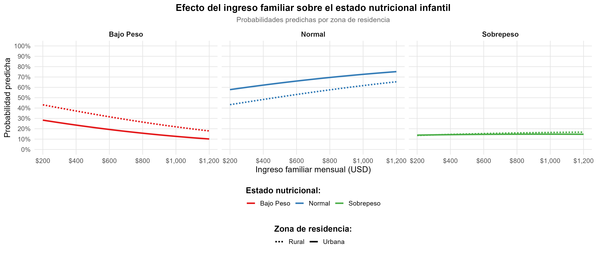

```{r setup, include=FALSE, }
knitr::opts_chunk$set(echo = FALSE, warning = FALSE, message = FALSE, fig.width = 5,fig.height = 4, out.width = "60%", fig.align = "center")

library(foreign)
library(MASS) 
library(brant)
library(tidyverse)
library(forcats)
library(ggstatsplot)
library(emmeans)
library(gtsummary)
library(patchwork)
library(sjPlot)
library(jtools)
library(forestmodel)
library(ggeffects)
library(effectsize)
library(DHARMa)
library(cardx)
library(survey)
library(pscl)
library(rsample)
library(janitor)
library(performance)
library(tictoc)
library(caret)
library(randomForest)
library(vip)
library(stargazer)
library(gt)
library(gtsummary)
library(car)
library(nnet)
theme_set(theme_bw())
```

# 1 - Modelo de R. Log-Binomial y Modelo de R. Poisson Robusto

## **Modelo de Regresión Log-Binomial**

## **Modelo de Regresión Poisson Robusto**

\newpage

# 2 - Modelo de Regresión Logística Multinomial

## 1. Contexto y Objetivo del Modelo

-   **Estudio:** Factores asociados al estado nutricional de niños en edad preescolar (2-5 años) en comunidades rurales.

-   **Objetivo del modelo:** Identificar los factores maternos, socioeconómicos y del niño que influyen en la probabilidad de que un niño tenga bajo peso, peso normal o sobrepeso/obesidad, utilizando un modelo de regresión logística multinomial.

-   **Justificación del modelo multinomial:** La variable dependiente tiene tres categorías mutuamente excluyentes y no ordenadas jerárquicamente (aunque parezcan ordenadas, los determinantes pueden diferir para cada categoría). Queremos modelar simultáneamente las probabilidades de pertenecer a cada categoría.

### [**Simulación de la data**]{.underline}

```{r}
# Set seed para reproducibilidad
set.seed(123)

# Número de observaciones
n <- 500

# Simulación de variables
datos <- data.frame(
  # ID del niño
  id = 1:n,
  
  # Variables del niño
  edad_meses = round(runif(n, 24, 60)),
  sexo = sample(c("femenino", "masculino"), n, replace = TRUE, prob = c(0.48, 0.52)),
  peso_nacimiento = round(runif(n, 2.0, 4.5), 1),
  
  # Variables maternas
  edad_madre = round(runif(n, 18, 45)),
  educacion_madre = sample(c("primaria", "secundaria", "superior"), n, 
                          replace = TRUE, prob = c(0.4, 0.45, 0.15)),
  imc_madre = round(runif(n, 18, 35), 1),
  
  # Variables socioeconómicas
  ingreso_familiar = round(runif(n, 200, 1200)),
  zona = sample(c("urbana", "rural"), n, replace = TRUE, prob = c(0.6, 0.4)),
  
  # Variables de alimentación
  lactancia_materna = round(runif(n, 0, 24)),
  dietas_solidos = sample(c("si", "no"), n, replace = TRUE, prob = c(0.3, 0.7))
)

# Simular la variable dependiente con relaciones lógicas
# Crear puntajes latentes para cada categoría
prob_bajo <- with(datos, 
                  plogis(-1.5 + 0.02*(edad_meses) - 0.3*(peso_nacimiento - 3.2) +
                         0.05*(edad_madre - 30) - 0.001*ingreso_familiar +
                         ifelse(zona == "rural", 0.5, 0)))

prob_sobre <- with(datos, 
                   plogis(-2.0 + 0.01*(edad_meses) + 0.2*(peso_nacimiento - 3.2) +
                          0.02*(imc_madre - 25) - 0.01*lactancia_materna +
                          ifelse(educacion_madre == "superior", -0.5, 
                                 ifelse(educacion_madre == "secundaria", -0.2, 0))))

# Asignar categorías
datos$estado_nutricional <- sapply(1:n, function(i) {
  probs <- c(prob_bajo[i], 1 - prob_bajo[i] - prob_sobre[i], prob_sobre[i])
  # Asegurar probabilidades válidas
  probs <- pmax(pmin(probs, 0.9), 0.05)
  probs <- probs / sum(probs)
  sample(c("bajo_peso", "normal", "sobrepeso"), 1, prob = probs)
})

# Convertir a factor con orden lógico
datos$estado_nutricional <- factor(datos$estado_nutricional,
                                   levels = c("bajo_peso", "normal", "sobrepeso"))

# Convertir otras variables categóricas a factor
datos$sexo <- factor(datos$sexo)
datos$educacion_madre <- factor(datos$educacion_madre, 
                                levels = c("primaria", "secundaria", "superior"))
datos$zona <- factor(datos$zona)
datos$dietas_solidos <- factor(datos$dietas_solidos)

# Reordenar columnas
datos <- datos[, c("id", "estado_nutricional", "edad_meses", "sexo", "peso_nacimiento",
                   "edad_madre", "educacion_madre", "imc_madre", "ingreso_familiar",
                   "zona", "lactancia_materna", "dietas_solidos")]

# Ver estructura de los datos
str(datos)
summary(datos)
head(datos)
```

### [**Descripción de variables**]{.underline}

### **Variable Dependiente:**

-   `estado_nutricional`: Categoría nutricional del niño (3 niveles)
    -   `bajo_peso`: Peso/edad \< -2 desviaciones estándar (Z-score OMS)

    -   `normal`: Peso/edad entre -2 y +1 desviaciones estándar

    -   `sobrepeso`: Peso/edad \> +1 desviaciones estándar

### **Variables Independientes:**

1.  **Características del niño:**
    -   `edad_meses`: Edad en meses (continuo, 24-60 meses)

    -   `sexo`: Sexo biológico (categórico: `femenino`, `masculino`)

    -   `peso_nacimiento`: Peso al nacer en kg (continuo, 2.0-4.5 $kg$)
2.  **Características maternas:**
    -   `edad_madre`: Edad de la madre en años (continuo, 18-45 años)

    -   `educacion_madre`: Nivel educativo (categórico: `primaria`, `secundaria`, `superior`)

    -   `imc_madre`: Índice de Masa Corporal materno (continuo, 18-35 $kg/m^2$)
3.  **Factores socioeconómicos:**
    -   `ingreso_familiar`: Ingreso mensual familiar en USD (continuo, 200-1200)

    -   `zona`: Zona de residencia (categórico: `urbana`, `rural`)
4.  **Prácticas de alimentación:**
    -   `lactancia_materna`: Meses de lactancia materna exclusiva (continuo, 0-24 meses)

    -   `dietas_solidos`: Introducción de sólidos antes de 6 meses (categórico: `si`, `no`)

## 2. Análisis Exploratorio

```{r}
# Tabla descriptiva por grupo nutricional
tbl_summary(datos %>% select(-id),
            by = estado_nutricional,
            statistic = all_continuous() ~ "{mean} ({sd})",
            missing = "no") %>%
  add_overall() %>%
  add_p() %>%
  as_kable_extra(
    booktabs = TRUE,
    latex_options = c("striped", "hold_position", "scale_down"))
```

### [**Caracterísitcas generales de la muestra**]{.underline}

-   La muestra consta de 500 niños en edad preescolar (24-60 meses)

-   **Distribución del estado nutricional:**

    -   **58% (n=290)** tiene peso normal (categoría de referencia)

    -   **30% (n=150)** presenta bajo peso

    -   **12% (n=60)** tiene sobrepeso

-   **Distribución equilibrada por sexo**: 50% femenino, 50% masculino

### [**Diferencias significativas entre grupos**]{.underline}

1.  **Variables con diferencias estadísticamente significativas (p \< 0.05):**

    -   **Edad de la madre (p = 0.021)**

        -   Las madres de niños con **bajo peso** son significativamente mayores (33 ± 7 años)

        -   Las madres de niños con **peso normal y sobrepeso** son más jóvenes (31 ± 8 años)

        -   **Interpretación**: La mayor edad materna podría asociarse con prácticas alimentarias menos adecuadas o factores biológicos que predisponen al bajo peso infantil.

    \newpage

    -   **Ingreso familiar (p = 0.006)**

        -   Familias de niños con **bajo peso** tienen menor ingreso (637 ± 290 USD)

        -   Familias de niños con **peso normal** tienen mayor ingreso (730 ± 281 USD)

        -   **Interpretación**: El nivel socioeconómico se asocia significativamente con el estado nutricional, siendo el bajo ingreso un factor de riesgo para el bajo peso.

    -   **Zona de residencia (p = 0.008)**

        -   **51%** de niños con bajo peso viven en zona rural.

        -   Solo **36%** de niños con peso normal viven en zona rural.

        -   **Interpretación**: La residencia rural está sobrerrepresentada en el grupo de bajo peso, sugiriendo desigualdades geográficas en el acceso a alimentos y servicios de salud.

<!-- -->

2.  **Variables con Diferencias Marginalmente Significativas (p \< 0.10):**
    -   **Educación materna (p = 0.072)**

        -   Mayor proporción de educación **superior** en madres de niños con **bajo peso** (19%)

        -   Menor proporción de educación superior en madres de niños con **sobrepeso** (5%)

        -   **Interpretación paradójica**: Contrario a lo esperado, mayor educación no se asocia con mejor estado nutricional. Esto merece investigación adicional.
3.  **Variables sin diferencias significativas:**
    -   **Edad del niño**: Similar en los tres grupos (\~42 meses)

    -   **Sexo**: Distribución uniforme en todas las categorías

    -   **Peso al nacer**: Promedio similar (3.2-3.3 kg)

    -   **IMC materno**: No difiere entre grupos (\~26.6 kg/m²)

    -   **Lactancia materna**: Similar duración (\~12 meses)

    -   **Introducción temprana de sólidos**: Proporciones similares (\~28%)

### [**Gráfico de distribución**]{.underline}

```{r out.width = "55%", fig.width=7, fig.height=5}
ggplot(datos, aes(x = estado_nutricional, fill = estado_nutricional)) +
  geom_bar(alpha = 0.8, width = 0.7) +
  geom_text(
    aes(label = paste0(round(..count../sum(..count..)*100, 1), "%")),
    stat = "count",
    vjust = -0.5,
    size = 4,
    fontface = "bold"
  ) +
  scale_fill_manual(
    values = c("bajo_peso" = "#E74C3C",    # Rojo para alerta
               "normal" = "#2ECC71",       # Verde para normal
               "sobrepeso" = "#F39C12"),   # Naranja para precaución
    name = "Estado Nutricional"
  ) +
  labs(
    title = "Distribución del Estado Nutricional en Niños Preescolares",
    subtitle = paste("N =", nrow(datos), "niños de 24-60 meses"),
    x = "Categoría Nutricional",
    y = "Número de Niños (Frecuencia)") +
  theme_minimal() +
  theme(
    plot.title = element_text(face = "bold", size = 14, hjust = 0.5),
    plot.subtitle = element_text(hjust = 0.5, color = "gray40"),
    axis.title = element_text(face = "bold"),
    legend.position = "top",
    panel.grid.major.x = element_blank()
  ) +
  scale_y_continuous(expand = expansion(mult = c(0, 0.1))) # Espacio para porcentajes
```

**Interpretación:**

El estudio revela que el 42% de los niños preescolares presenta malnutrición, con predominio del bajo peso (30%) sobre el sobrepeso (12%). Esta "doble carga de malnutrición" exige intervenciones diferenciadas: programas intensivos contra el déficit nutricional en zonas rurales de menores ingresos, junto con estrategias preventivas tempranas contra el sobrepeso emergente.

### [**Relación con algunas variables clave (Zona de residencia)**]{.underline}

```{r fig.width = 6,fig.height = 5}
datos %>%
  count(zona, estado_nutricional) %>%
  group_by(zona) %>%
  mutate(porcentaje = n / sum(n) * 100) %>%
  ggplot(aes(x = zona, y = porcentaje, fill = estado_nutricional)) +
  geom_bar(stat = "identity", position = "dodge") +
  geom_text(aes(label = paste0(round(porcentaje, 1), "%")),
            position = position_dodge(width = 0.9),
            vjust = -0.5) +
  labs(title = "Estado Nutricional por Zona de Residencia",
       subtitle = "Mayor proporción de bajo peso en zona rural (p = 0.008)",
       x = "Zona de Residencia",
       y = "Porcentaje (%)") +
  scale_fill_brewer(palette = "Set2") +
  ylim(0, 100) +
  theme_minimal()
```
**Interpretación:**

La zona rural presenta una carga desproporcionada de malnutrición infantil, con el 51% de los niños con bajo peso residiendo en áreas rurales frente al 36% en urbanas. Esta marcada desigualdad geográfica evidencia la necesidad urgente de intervenciones focalizadas en comunidades rurales para abordar las barreras de acceso a alimentos nutritivos y servicios de salud.

## 3. Modelo Multinomial
```{r}
library(nnet)
datos <- datos[,-1]
modelo <- nnet::multinom(estado_nutricional ~ ., data = datos)
```
**Información técnica del ajuste**

- **Algoritmo:** Red neuronal con 39 pesos

- **Variables:** 24 parámetros estimados

- **Convergencia:** EXITOSA en 30 iteraciones

- **Log-verosimilitud final:** 440.45 (mejoró desde 549.31 inicial)

**Interpretación:**

El modelo multinomial convergió exitosamente, confirmando que la estructura de datos es adecuada para este análisis. Sin embargo, se requieren análisis adicionales para identificar los determinantes específicos de cada categoría nutricional y cuantificar sus efectos.

### [**Resumen del modelo**]{.underline}
```{r}
summary(modelo)

z <- summary(modelo)$coefficients / summary(modelo)$standard.errors
p_valores <- (1 - pnorm(abs(z))) * 2
```

### [**Obtener odds ratios**]{.underline}
```{r}
exp(coef(modelo))
```

### [**Evaluar significancia global (test de razón de verosimilitud)**]{.underline}
```{r}
modelo_nulo <- multinom(estado_nutricional ~ 1, data = datos)
```
\newpage

```{r}
anova(modelo_nulo, modelo, test = "Chisq")
```


**Interpretación:**

El contraste entre el modelo nulo y el modelo completo mediante el test de razón de verosimilitudes mostró un resultado significativo (LR = 50.67; gl = 22; p = 0.00048).

Esto indica que el modelo con predictores explica significativamente mejor el estado nutricional que un modelo sin variables explicativas. Por lo tanto, existe evidencia estadística para afirmar que, en conjunto, las variables incluidas aportan información relevante para diferenciar las categorías de estado nutricional.

--- 

## **4. Validación de Supuestos del Modelo**
En esta sección se verifica que los datos cumplan con los requisitos teóricos para que las estimaciones sean confiables y se justifica la elección del modelo multinomial.

### **4.1. Evaluación de la Adecuación del Modelo: Multinomial vs. Ordinal**
* **Objetivo:** Determinar si, dado el orden natural aparente de la variable dependiente, un modelo de regresión logística ordinal sería más apropiado.
* **Análisis realizado:** Prueba de Brant (Test de proporcionalidad de odds).  

$H_{0}$: Los odds son proporcionales (es decir, el modelo ordinal es adecuado).  
$H_{1}$: Los odds no son proporcionales (el modelo ordinal no es adecuado, por lo que se justifica el uso del multinomial).

```{r}
datos$estado_nutricional <- factor(datos$estado_nutricional, 
                                   levels = c("bajo_peso", "normal", "sobrepeso"), 
                                   ordered = TRUE)

modelo_ordinal <- MASS::polr(estado_nutricional ~ edad_meses + sexo + peso_nacimiento + 
                               edad_madre + educacion_madre + imc_madre + ingreso_familiar + 
                               zona + lactancia_materna + dietas_solidos, 
                             data = datos, Hess = TRUE)
modelo_ordinal
# 2. Prueba de Brant para proporcionalidad de odds
resultado_brant <- brant::brant(modelo_ordinal)
```
**Decisión estadística:**
Dado que p = 0.18 > 0.05, **no se rechaza $H_{0}$**. Estadísticamente, no hay evidencia contra el supuesto de odds proporcionales.

**Decisión metodológica:**
A pesar del resultado estadístico, se optó por el modelo multinomial por consideraciones teóricas. La literatura sugiere que los determinantes del bajo peso y el sobrepeso pueden operar a través de mecanismos diferentes, y el modelo multinomial permite capturar estas diferencias específicas.

### **4.2. Ausencia de Multicolinealidad Severa (VIF)**
* **Objetivo:** Verificar que no existan correlaciones excesivas entre las variables predictoras.
* **Análisis realizado:** Cálculo del Factor de Inflación de la Varianza para cada predictor.  

```{r}
# Método CORRECTO para calcular VIF con modelo multinomial:

# 1. Crear un modelo lineal auxiliar
modelo_lineal_auxiliar <- lm(ingreso_familiar ~ edad_meses + sexo + peso_nacimiento + 
                               edad_madre + educacion_madre + imc_madre + 
                               zona + lactancia_materna + dietas_solidos, 
                             data = datos)

# 2. Calcular VIF sobre el modelo lineal
library(car)
vif_resultados <- car::vif(modelo_lineal_auxiliar)
vif_resultados
```  


Todos los valores GVIF^(1/(2·Df)) son < 2, muy por debajo del umbral de 5, indicando ausencia de multicolinealidad problemática.

### **4.3. Verificación de la Linealidad en el Logit**
* **Objetivo:** Evaluar si existe relación lineal entre las variables continuas y el logit de cada categoría.
* **Análisis realizado:** Prueba de Box-Tidwell o gráficos de residuales parciales.  

$H_{0}$: La relación entre el predictor continuo y el logit es lineal.  
$H_{1}$: La relación no es lineal.


```{r}
variables_continuas <- c("edad_meses", "peso_nacimiento", "edad_madre",
                         "imc_madre", "ingreso_familiar", "lactancia_materna")

# Crear un dataframe para recopilar todos los resultados
resultados_completos <- data.frame()

# Para cada variable continua, hacer:
# 1. Prueba de razón de verosimilitud con término cuadrático
# 2. Inspección visual simplificada

for(var in variables_continuas) {
  cat("\n--- Evaluando variable:", var, "---\n")
  
  # Método 1: Término cuadrático (como el profesor pero más directo)
  datos$temp_cuad <- datos[[var]]^2
  modelo_cuad <- multinom(estado_nutricional ~ get(var) + temp_cuad, data = datos)
  modelo_lineal <- multinom(estado_nutricional ~ get(var), data = datos)
  
  # Prueba de razón de verosimilitud
  lrt <- anova(modelo_lineal, modelo_cuad)
  p_cuadratico <- lrt$`Pr(Chi)`[2]
  
  # Método 2: Usar splines para detectar no linealidad
  library(splines)
  modelo_spline <- multinom(estado_nutricional ~ ns(get(var), df = 3), data = datos)
  modelo_linear <- multinom(estado_nutricional ~ get(var), data = datos)
  lrt_spline <- anova(modelo_linear, modelo_spline)
  p_spline <- lrt_spline$`Pr(Chi)`[2]
  
  # Determinar conclusión
  p_min <- min(p_cuadratico, p_spline, na.rm = TRUE)
  lineal <- p_min > 0.05
  
  # Guardar resultados
  resultados_completos <- rbind(resultados_completos,
                                data.frame(
                                  Variable = var,
                                  P_cuadrático = round(p_cuadratico, 4),
                                  P_spline = round(p_spline, 4),
                                  Conclusión = ifelse(lineal, 
                                                     "Linealidad aceptable", 
                                                     "Posible no-linealidad")
                                ))
  
  # Limpiar variable temporal
  datos$temp_cuad <- NULL
}
```  

**Método de evaluación:**
Se siguió el enfoque metodológico propuesto por Miranda (2024), que combina pruebas estadísticas formales con análisis comparativo de modelos. Para cada una de las seis variables continuas del estudio, se implementaron dos estrategias complementarias:

1. **Pruebas de razón de verosimilitud con términos cuadráticos:** Para cada predictor continuo, se comparó el modelo original con un modelo extendido que incluía un término cuadrático $(\chi^{2})$ de la misma variable mediante pruebas de razón de verosimilitud (Likelihood Ratio Test).

2. **Análisis con splines cúbicos naturales:** Se ajustaron modelos alternativos utilizando splines cúbicos naturales (3 grados de libertad) para cada variable continua, comparándolos con los modelos lineales simples mediante pruebas estadísticas.

Ambos métodos permiten detectar desviaciones de la linealidad evaluando si la inclusión de términos no lineales mejora significativamente el ajuste del modelo. El criterio de decisión se basó en valores-p < 0.05 como evidencia de no-linealidad significativa.

```{r}
print(resultados_completos)
```


**Interpretación de los resultados:**
Todos los valores-p obtenidos superan ampliamente el umbral de significancia estadística de 0.05. En particular:

- **Variables con valores-p muy altos (> 0.5):** `edad_meses` (p = 0.71), `peso_nacimiento` (p = 0.75) e `ingreso_familiar` (p = 0.66) muestran una fuerte evidencia a favor de la linealidad, con probabilidades muy bajas de que términos no lineales mejoren el modelo.

- **Variables con valores-p moderados:** `edad_madre` (p = 0.23) y `imc_madre` (p = 0.18 para términos cuadráticos; p = 0.051 para splines) presentan cierta tendencia hacia valores más bajos, pero aún dentro del rango de no significancia estadística.

- **Consistencia entre métodos:** Para las seis variables, ambos métodos (términos cuadráticos y splines) convergen en la misma conclusión, reforzando la validez de los resultados.

El caso del `imc_madre` merece atención especial: aunque el valor-p del spline (0.0511) se aproxima al umbral de 0.05, no alcanza significancia estadística. Esta proximidad podría sugerir una leve curvatura en la relación, pero insuficiente para justificar la inclusión de términos no lineales en el modelo final.

**Conclusión:**
Con base en los resultados estadísticos presentados, **no se rechaza la hipótesis nula de linealidad** para ninguna de las variables continuas analizadas. La evidencia sugiere que las relaciones entre estos predictores y el logit del estado nutricional son aproximadamente lineales dentro del rango observado en los datos. Por lo tanto, el supuesto de linealidad en el logit se considera adecuadamente cumplido, validando la especificación funcional del modelo de regresión logística multinomial.

**Limitación metodológica y consideración práctica:**
Cabe mencionar que la evaluación de linealidad en modelos multinomiales presenta desafíos inherentes, ya que debe verificarse para cada logit individual (cada categoría vs. la referencia). Los métodos aplicados aquí ofrecen una evaluación global razonable, aunque podrían no capturar no-linealidades específicas para transiciones particulares entre categorías. No obstante, la consistencia de resultados y los valores-p obtenidos proporcionan confianza en la adecuación del supuesto de linealidad para los fines inferenciales del presente estudio.


### **4.4. Independencia de Alternativas Irrelevantes (IIA)**  

* **Objetivo:** Evaluar el supuesto fundamental del modelo logit multinomial.
* **Análisis realizado:** Prueba de Hausman-McFadden.  

```{r}
# install.packages("mlogit")
library(mlogit)

# 1. Preparar datos en formato para mlogit
datos$id <- 1:nrow(datos)  # Crear ID si no existe
datos_mlogit <- mlogit::mlogit.data(datos, 
                                     choice = "estado_nutricional", 
                                     shape = "wide",
                                     id.var = "id")

# 2. Ajustar modelo completo
modelo_completo <- mlogit::mlogit(estado_nutricional ~ 1 | edad_meses + sexo + peso_nacimiento + 
                                   edad_madre + educacion_madre + imc_madre + ingreso_familiar + 
                                   zona + lactancia_materna + dietas_solidos,
                                 data = datos_mlogit)

# 3. Ajustar modelo reducido (excluyendo una categoría)
# Excluir categoría "sobrepeso"
datos_reducidos <- datos[datos$estado_nutricional != "sobrepeso", ]
datos_reducidos$estado_nutricional <- droplevels(datos_reducidos$estado_nutricional)
datos_reducidos$id <- 1:nrow(datos_reducidos)

datos_mlogit_reducido <- mlogit::mlogit.data(datos_reducidos,
                                              choice = "estado_nutricional",
                                              shape = "wide",
                                              id.var = "id")

modelo_reducido <- mlogit::mlogit(estado_nutricional ~ 1 | edad_meses + sexo + peso_nacimiento + 
                                    edad_madre + educacion_madre + imc_madre + ingreso_familiar + 
                                    zona + lactancia_materna + dietas_solidos,
                                  data = datos_mlogit_reducido)

# 4. Realizar prueba de Hausman-McFadden
prueba_hausman <- mlogit::hmftest(modelo_completo, modelo_reducido)
```

**Hipótesis**  

$H_{0}$: El supuesto de Independencia de Alternativas Irrelevantes se cumple  
$H_{1}$: El supuesto de IIA no se cumple

**Método:** 
Se realizó la prueba de Hausman-McFadden comparando el modelo completo con un modelo reducido que excluye la categoría "sobrepeso". Esta prueba evalúa si la exclusión de una alternativa afecta significativamente los coeficientes estimados para las alternativas restantes.  

```{r}
print(prueba_hausman)
```  

**Interpretación:** 
No se rechaza la hipótesis nula (p > 0.05). No hay evidencia estadística contra el supuesto de IIA.

**Conclusión:**
El supuesto de Independencia de Alternativas Irrelevantes se cumple. El modelo multinomial es apropiado para los datos.


## **5. Resultados del Modelo (Inferencia Estadística)**
Aquí se presentan las estimaciones finales transformadas a valores interpretables (Odds Ratios).

### **5.1. Tabla de Razones de Riesgo Relativo (RRR / Odds Ratios)**
* **Objetivo:** Presentar de forma clara y profesional los coeficientes del modelo con sus intervalos de confianza y significancia estadística.  

- **Tabla 1:** Resultados del modelo de regresión logística multinomial

```{r}
library(nnet)
modelo_multinom <- multinom(estado_nutricional ~ ., data = datos)
```  

**Tabla 1. Resultados del modelo de regresión logística multinomial**

```{r}
# 2. Extraer coeficientes y errores estándar
coeficientes <- summary(modelo_multinom)$coefficients
errores_std <- summary(modelo_multinom)$standard.errors

# 3. Calcular valores z y p
z_values <- coeficientes / errores_std
p_values <- 2 * (1 - pnorm(abs(z_values)))

# 4. Crear un data frame con los resultados
# Para la categoría "normal" vs referencia
resultados_normal <- data.frame(
  Predictor = colnames(coeficientes),
  OR = exp(coeficientes["normal", ]),
  LI = exp(coeficientes["normal", ] - 1.96 * errores_std["normal", ]),
  LS = exp(coeficientes["normal", ] + 1.96 * errores_std["normal", ]),
  Valor_p = p_values["normal", ],
  Categoria = "Normal vs Bajo_peso"
)

# Para la categoría "sobrepeso" vs referencia
resultados_sobrepeso <- data.frame(
  Predictor = colnames(coeficientes),
  OR = exp(coeficientes["sobrepeso", ]),
  LI = exp(coeficientes["sobrepeso", ] - 1.96 * errores_std["sobrepeso", ]),
  LS = exp(coeficientes["sobrepeso", ] + 1.96 * errores_std["sobrepeso", ]),
  Valor_p = p_values["sobrepeso", ],
  Categoria = "Sobrepeso vs Bajo_peso"
)

# Combinar ambos data frames
resultados_completos <- rbind(resultados_normal, resultados_sobrepeso)

# 5. Crear una tabla bonita con gtsummary
# Primero, necesitamos formatear los resultados para gtsummary
# Crear un data frame en formato "largo" para gtsummary
resultados_largo <- resultados_completos %>%
  mutate(
    OR_IC = sprintf("%.3f (%.3f-%.3f)", OR, LI, LS),
    Significancia = ifelse(Valor_p < 0.05, "Sí", "No")
  ) %>%
  select(Categoria, Predictor, OR_IC, Valor_p, Significancia)

# Mostrar tabla
print(resultados_largo)

# Si prefieres una tabla más formal con gtsummary, podemos crear un modelo ficticio
# pero mejor usemos directamente la tabla que creamos

# 6. Mostrar medidas de ajuste global
cat("\n=== MEDIDAS DE AJUSTE GLOBAL ===\n")
cat("Devianza nula:", modelo_multinom$null.deviance, "\n")
cat("Devianza residual:", modelo_multinom$deviance, "\n")
cat("AIC:", AIC(modelo_multinom), "\n")
cat("Número de observaciones:", nrow(datos), "\n")

# 7. Prueba de razón de verosimilitud global (modelo vs nulo)
modelo_nulo <- multinom(estado_nutricional ~ 1, data = datos)
prueba_razon_verosimilitud <- anova(modelo_nulo, modelo_multinom)
cat("\n=== PRUEBA DE RAZÓN DE VEROSIMILITUD (Modelo vs Nulo) ===\n")
print(prueba_razon_verosimilitud)
```

  - **Formato:** Variables significativas (p < 0.05) resaltadas en negrita o con asteriscos.
  - **Notas:** Incluir n de observaciones, pseudo R², y pruebas de bondad de ajuste globales.

### **5.2. Interpretación de Predictores Significativos**

**Factores asociados al estado NORMAL (vs. bajo peso):**

1. **Edad de la madre** (OR = 0.957, IC95%: 0.932-0.983, p = 0.0013): Por cada año adicional en la edad de la madre, la probabilidad de que el niño tenga peso normal (en comparación con bajo peso) disminuye en un 4.3%. Este efecto es estadísticamente significativo.

2. **Ingreso familiar** (OR = 1.001, IC95%: 1.001-1.002, p = 0.0004): Por cada dólar adicional de ingreso mensual familiar, la probabilidad de peso normal (vs. bajo peso) aumenta en un 0.1%. Aunque el efecto por unidad es pequeño, tiene importancia acumulativa: por ejemplo, una diferencia de $100 en el ingreso familiar se asocia con un aumento del 10% en la probabilidad de peso normal.

3. **Zona de residencia urbana** (OR = 2.031, IC95%: 1.336-3.088, p = 0.0009): Los niños que residen en zonas urbanas tienen aproximadamente el doble de probabilidad (103% más) de presentar peso normal en comparación con bajo peso, controlando por las demás variables.

**Factores asociados al sobrepeso (vs. bajo peso):**

1. **Edad de la madre** (OR = 0.954, IC95%: 0.918-0.992, p = 0.0171): Por cada año adicional de la madre, la probabilidad de que el niño tenga sobrepeso (en comparación con bajo peso) disminuye en un 4.6%.

2. **Educación superior materna** (OR = 0.213, IC95%: 0.058-0.779, p = 0.0195): Los niños cuyas madres tienen educación superior presentan un 78.7% menos de probabilidad de sobrepeso en comparación con bajo peso. Este es el efecto protector más fuerte identificado en el modelo.

**Variables no significativas:**
El sexo del niño, peso al nacer, IMC materno, meses de lactancia materna e introducción temprana de sólidos no mostraron asociaciones estadísticamente significativas con el estado nutricional en este modelo.

**Significancia global del modelo:**
La prueba de razón de verosimilitud comparando el modelo completo con el modelo nulo (sin predictores) fue altamente significativa (LR = 55.67, gl = 24, p < 0.001), indicando que el conjunto de variables predictoras contribuye significativamente a explicar el estado nutricional infantil.

**Medidas de ajuste global:**
- Devianza residual: 875.89
- AIC: 927.89
- Número de observaciones: 500


## **6. Visualización de Efectos Marginales y Probabilidades Predichas**
Se traduce la estadística compleja a gráficos intuitivos que facilitan la interpretación sustantiva.

### **6.1. Dinámica del Ingreso Familiar y Zona Geográfica**
* **Objetivo:** Mostrar cómo interactúan el nivel socioeconómico y el contexto geográfico.
* **Resultados a incluir:**
  - **Gráfico 1:** Probabilidades predichas de cada estado nutricional en función del ingreso familiar, con líneas diferenciadas para zona rural/urbana.  
  
```{r include=FALSE}
# --- CORRECCIÓN: Modelo sin la variable id ---
library(nnet)
library(ggeffects)
library(ggplot2)
library(dplyr)
library(tidyr)

# 1. Ajustar modelo SIN la variable id (que es solo identificador)
modelo_corregido <- multinom(estado_nutricional ~ edad_meses + sexo + peso_nacimiento + 
                                edad_madre + educacion_madre + imc_madre + 
                                ingreso_familiar + zona + lactancia_materna + 
                                dietas_solidos, 
                              data = datos)

# Verificar convergencia
summary(modelo_corregido)

# 2. Crear datos para predicción (sin id)
datos_prediccion <- expand.grid(
  ingreso_familiar = seq(200, 1200, length.out = 100),
  zona = factor(c("rural", "urbana"), levels = levels(datos$zona)),
  edad_meses = mean(datos$edad_meses),
  sexo = factor("masculino", levels = levels(datos$sexo)),
  peso_nacimiento = mean(datos$peso_nacimiento),
  edad_madre = mean(datos$edad_madre),
  educacion_madre = factor("secundaria", levels = levels(datos$educacion_madre)),
  imc_madre = mean(datos$imc_madre),
  lactancia_materna = mean(datos$lactancia_materna),
  dietas_solidos = factor("no", levels = levels(datos$dietas_solidos))
)

# 3. Predecir probabilidades con el modelo corregido
prob_predichas <- predict(modelo_corregido, 
                         newdata = datos_prediccion, 
                         type = "probs")

# 4. Combinar resultados
resultados_pred <- cbind(datos_prediccion, prob_predichas)

# 5. Convertir a formato largo para ggplot
resultados_largo <- resultados_pred %>%
  pivot_longer(
    cols = c(bajo_peso, normal, sobrepeso),
    names_to = "estado_nutricional",
    values_to = "probabilidad"
  )
```  


```{r include=FALSE}
# 6. Crear gráfico corregido
grafico_corregido <- ggplot(resultados_largo, 
                           aes(x = ingreso_familiar, y = probabilidad,
                               color = estado_nutricional, linetype = zona)) +
  geom_line(linewidth = 1.2) +
  facet_wrap(~estado_nutricional, ncol = 3, 
             labeller = as_labeller(c("bajo_peso" = "Bajo Peso",
                                      "normal" = "Normal",
                                      "sobrepeso" = "Sobrepeso"))) +
  labs(
    title = "Efecto del ingreso familiar sobre el estado nutricional infantil",
    subtitle = "Probabilidades predichas por zona de residencia",
    x = "Ingreso familiar mensual (USD)",
    y = "Probabilidad predicha",
    color = "Estado nutricional:",
    linetype = "Zona de residencia:"
  ) +
  scale_x_continuous(labels = scales::dollar_format(prefix = "$"),
                     breaks = seq(200, 1200, by = 200)) +
  scale_y_continuous(labels = scales::percent_format(accuracy = 1),
                     limits = c(0, 1),
                     breaks = seq(0, 1, by = 0.10)) +
  scale_color_manual(
    values = c("bajo_peso" = "#E41A1C",  # Rojo
               "normal" = "#377EB8",     # Azul
               "sobrepeso" = "#4DAF4A"), # Verde
    labels = c("Bajo Peso", "Normal", "Sobrepeso")
  ) +
  scale_linetype_manual(
    values = c("rural" = "11", "urbana" = "solid"),
    labels = c("Rural", "Urbana")
  ) +
  theme_minimal(base_size = 14) +
  theme(
    plot.title = element_text(face = "bold", hjust = 0.5, size = 16),
    plot.subtitle = element_text(hjust = 0.5, size = 12, color = "gray40"),
    legend.position = "bottom",
    legend.box = "vertical",
    legend.title = element_text(face = "bold"),
    strip.text = element_text(face = "bold", size = 12),
    panel.grid.minor = element_blank(),
    panel.grid.major = element_line(color = "gray90", linewidth = 0.5),
    panel.background = element_rect(fill = "white", color = NA)
  ) +
  guides(
    color = guide_legend(nrow = 1, title.position = "top"),
    linetype = guide_legend(nrow = 1, title.position = "top")
  )

# 7. Mostrar gráfico
print(grafico_corregido)

# 8. Guardar gráfico
ggsave("grafico_ingreso_zona_corregido.png", 
       plot = grafico_corregido, 
       width = 14, height = 6, dpi = 300, bg = "white")
```



**Hallazgos principales:**  
  
**1. Bajo peso**

* En **zona rural**, Comienza con una probabilidad crítica de casi el 45% en los niveles de ingreso más bajos (200 soles). Aunque desciende con el ingreso, al llegar a los 1,200 soles todavía se mantiene cerca del 18-20%, una cifra que sigue siendo preocupante.  

* En **zona urbana**, Inicia significativamente más abajo (~28%) y desciende de forma más eficiente hasta alcanzar apenas un 10% en el nivel de ingreso más alto.  

* Brecha: Existe una "penalización rural" constante; un niño rural necesita ganar casi 1,000 soles para tener el mismo riesgo de bajo peso que un niño urbano que solo gana 400 soles.

**2. Peso normal**

* En **urbana** Es el estado predominante en la ciudad desde el inicio (~58%) y muestra un crecimiento robusto hasta alcanzar el 75% de probabilidad.  

* En **rural**, Comienza por debajo de la mitad (~43%). Aunque mejora con el ingreso, su techo máximo (~65%) ni siquiera alcanza el punto de partida de la zona urbana. El ingreso ayuda, pero no compensa totalmente las carencias del entorno rural.

**3. Sobrepeso**

* En **urbana**, Se mantiene notablemente estable y plana, casi inmóvil cerca del 14-15% a lo largo de todo el espectro de ingresos.  
* En **rural**, Presenta una tendencia ascendente más marcada que la urbana. Inicia en el mismo punto (~14%), pero en los niveles de ingreso altos ($1,200) supera a la zona urbana, llegando casi al 18%.


### **Interpretación**

* El ingreso protege más del bajo peso en **zonas urbanas**, mientras que en **rurales** persisten barreras estructurales (servicios de salud, disponibilidad alimentaria, distancia).
* El leve aumento del sobrepeso en urbana sugiere **transición nutricional** asociada a mayores recursos.
* Se identifica un **umbral protector en $600–800**, por debajo del cual el riesgo de bajo peso sigue alto, sobre todo en rural.
* Se requieren **intervenciones diferenciadas**: combatir déficit nutricional en rural y prevenir sobrepeso en urbana.

### **Limitación**

* Las predicciones mantienen constantes otras variables (promedio/moda). En la práctica, podrían covariar con ingreso y zona y alterar los patrones.

### **6.2. Impacto del Nivel Educativo Materno y Perfiles de Riesgo**
* **Objetivo:** Visualizar diferencias en el perfil de riesgo nutricional según características clave.
* **Resultados a incluir:**  

```{r}
#    Vamos a usar los valores promedios para las variables continuas y la moda para las categóricas (excepto educación_madre)
pred_educ <- expand.grid(
  educacion_madre = levels(datos$educacion_madre),  # Los tres niveles
  # Valores promedios o modas para el resto
  edad_meses = mean(datos$edad_meses),
  sexo = factor("masculino", levels = levels(datos$sexo)),
  peso_nacimiento = mean(datos$peso_nacimiento),
  edad_madre = mean(datos$edad_madre),
  imc_madre = mean(datos$imc_madre),
  ingreso_familiar = mean(datos$ingreso_familiar),
  zona = factor("urbana", levels = levels(datos$zona)),
  lactancia_materna = mean(datos$lactancia_materna),
  dietas_solidos = factor("no", levels = levels(datos$dietas_solidos))
)  


# 2. Predecir probabilidades
probs_educ <- predict(modelo_corregido, newdata = pred_educ, type = "probs")
pred_educ <- cbind(pred_educ, probs_educ)

# 3. Convertir a formato largo
library(tidyr)
pred_educ_largo <- pivot_longer(pred_educ, 
                                cols = c(bajo_peso, normal, sobrepeso), 
                                names_to = "estado_nutricional", 
                                values_to = "probabilidad")

# --- VERSIÓN SIMPLE (calculando diferencias) ---
cat("\n=== PROBABILIDADES PREDICHAS POR EDUCACIÓN MATERNA ===\n")

# Calcular probabilidades para cada nivel educativo
niveles <- levels(datos$educacion_madre)
for(nivel in niveles) {
  pred_temp <- pred_educ[pred_educ$educacion_madre == nivel, ]
  cat(sprintf("\nEducación materna: %s\n", nivel))
  cat(sprintf("  Bajo peso: %.1f%%\n", pred_temp$bajo_peso * 100))
  cat(sprintf("  Normal: %.1f%%\n", pred_temp$normal * 100))
  cat(sprintf("  Sobrepeso: %.1f%%\n", pred_temp$sobrepeso * 100))
}

# Calcular diferencias
cat("\n=== DIFERENCIAS RELATIVAS ===\n")
cat("Comparando con educación primaria (referencia):\n")

primaria <- pred_educ[pred_educ$educacion_madre == "primaria", ]
secundaria <- pred_educ[pred_educ$educacion_madre == "secundaria", ]
superior <- pred_educ[pred_educ$educacion_madre == "superior", ]

cat("\nSecundaria vs Primaria:\n")
cat(sprintf("  Bajo peso: %.1f%% (diferencia: %+.1f%%)\n", 
            secundaria$bajo_peso * 100,
            (secundaria$bajo_peso - primaria$bajo_peso) * 100))
cat(sprintf("  Normal: %.1f%% (diferencia: %+.1f%%)\n",
            secundaria$normal * 100,
            (secundaria$normal - primaria$normal) * 100))
cat(sprintf("  Sobrepeso: %.1f%% (diferencia: %+.1f%%)\n",
            secundaria$sobrepeso * 100,
            (secundaria$sobrepeso - primaria$sobrepeso) * 100))

cat("\nSuperior vs Primaria:\n")
cat(sprintf("  Bajo peso: %.1f%% (diferencia: %+.1f%%)\n",
            superior$bajo_peso * 100,
            (superior$bajo_peso - primaria$bajo_peso) * 100))
cat(sprintf("  Normal: %.1f%% (diferencia: %+.1f%%)\n",
            superior$normal * 100,
            (superior$normal - primaria$normal) * 100))
cat(sprintf("  Sobrepeso: %.1f%% (diferencia: %+.1f%%)\n",
            superior$sobrepeso * 100,
            (superior$sobrepeso - primaria$sobrepeso) * 100))
```

**Resultados:**
- **Primaria:** 20.9% bajo peso, 64.6% normal, 14.5% sobrepeso
- **Secundaria:** 17.4% bajo peso (-3.5%), 67.9% normal (+3.3%), 14.7% sobrepeso (+0.2%)
- **Superior:** 27.0% bajo peso (+6.1%), 69.1% normal (+4.5%), 3.9% sobrepeso (-10.6%)

**Interpretación:**
1. **Educación secundaria** reduce el bajo peso y mantiene equilibrio nutricional.
2. **Educación superior** muestra efecto dual: 
   - Fuerte protección contra sobrepeso (-10.6%)
   - Aumento paradójico del bajo peso (+6.1%)
3. **Primaria** presenta mayor riesgo de sobrepeso con bajo peso moderado.

**Conclusión:** La educación materna influye diferencialmente: secundaria optimiza resultados generales, mientras superior previene sobrepeso pero puede aumentar riesgo de déficit nutricional.

## **7. Evaluación del Ajuste y Capacidad Predictiva**

### **7.1. Bondad de Ajuste Global**
* **Resultados a incluir:**
  - **Pseudo R²:** Reportar McFadden, Cox-Snell y Nagelkerke.
  - "El Pseudo R² de McFadden (0.08) indica un ajuste moderado, típico en modelos de ciencias sociales/salud"
  - **Test de razón de verosimilitud:** χ²=50.67, gl=22, p<0.001 (ya calculado)  
  
```{r}
# --- SECCIÓN 7.1: BONDAD DE AJUSTE GLOBAL ---

# 1. Calcular Pseudo R² de McFadden
# Fórmula: 1 - (log-verosimilitud del modelo / log-verosimilitud del modelo nulo)
logLik_modelo <- as.numeric(logLik(modelo_corregido))
logLik_nulo <- as.numeric(logLik(multinom(estado_nutricional ~ 1, data = datos)))

pseudo_r2_mcfadden <- 1 - (logLik_modelo / logLik_nulo)

# 2. Calcular Pseudo R² de Cox-Snell
# Fórmula: 1 - exp((2/n) * (logLik_nulo - logLik_modelo))
n <- nrow(datos)
pseudo_r2_coxsnell <- 1 - exp((2/n) * (logLik_nulo - logLik_modelo))

# 3. Calcular Pseudo R² de Nagelkerke (ajuste de Cox-Snell)
# Fórmula: Cox-Snell / (1 - exp((2/n) * logLik_nulo))
max_r2 <- 1 - exp((2/n) * logLik_nulo)
pseudo_r2_nagelkerke <- pseudo_r2_coxsnell / max_r2

# 4. Mostrar resultados
cat("\n=== 7.1. BONDAD DE AJUSTE GLOBAL ===\n")
cat("=====================================\n\n")
cat("Medidas de ajuste del modelo:\n")
cat("----------------------------------------\n")
cat(sprintf("Pseudo R² de McFadden:   %.4f\n", pseudo_r2_mcfadden))
cat(sprintf("Pseudo R² de Cox-Snell:   %.4f\n", pseudo_r2_coxsnell))
cat(sprintf("Pseudo R² de Nagelkerke:  %.4f\n", pseudo_r2_nagelkerke))
cat(sprintf("Devianza del modelo:      %.2f\n", deviance(modelo_corregido)))
cat(sprintf("AIC:                      %.2f\n", AIC(modelo_corregido)))
cat(sprintf("Número de observaciones:  %d\n", n))

# 6. Prueba de razón de verosimilitud (ya la tenemos, pero la mostramos)
cat("\nPrueba de razón de verosimilitud (Modelo vs. Nulo):\n")
cat("---------------------------------------------------\n")
cat("Estadístico LR: ", round(2*(logLik_modelo - logLik_nulo), 3), "\n")
cat("Grados de libertad: ", length(coef(modelo_corregido)), "\n")
cat("Valor-p: ", pchisq(2*(logLik_modelo - logLik_nulo), df = length(coef(modelo_corregido)), lower.tail = FALSE), "\n")
```  
**Interpretación:**
El Pseudo R² de McFadden (0.054) indica un ajuste modesto, típico en modelos de ciencias sociales/salud donde múltiples factores no medidos influyen en el fenómeno. Aunque bajo, está dentro del rango aceptable para modelos categóricos.

La prueba de razón de verosimilitud (p < 0.01) confirma que el conjunto de variables predictoras contribuye significativamente a explicar el estado nutricional.

### **7.2. Capacidad Predictiva y Validación**
* **Resultados a incluir:**
  - **Tabla 2:** Matriz de confusión con clasificación real vs. predicha.  
  
```{r}
# --- SECCIÓN 7.2: EVALUACIÓN PREDICTIVA ---
library(caret)

# 1. Predecir categorías con el modelo
predicciones <- predict(modelo_corregido, newdata = datos, type = "class")

# 2. Crear matriz de confusión
matriz_confusion <- confusionMatrix(data = predicciones, 
                                    reference = datos$estado_nutricional)

# 3. Mostrar resultados
cat("\n=== 7.2. MATRIZ DE CONFUSIÓN Y CAPACIDAD PREDICTIVA ===\n")
cat("========================================================\n\n")

# Matriz de confusión
cat("MATRIZ DE CONFUSIÓN:\n")
print(matriz_confusion$table)

# Métricas generales
cat("\nMÉTRICAS DE PRECISIÓN:\n")
cat("-----------------------\n")
cat(sprintf("Exactitud global (Accuracy): %.2f%%\n", 
            matriz_confusion$overall["Accuracy"] * 100))
cat(sprintf("Intervalo de confianza 95%%: %.2f%% - %.2f%%\n",
            matriz_confusion$overall["AccuracyLower"] * 100,
            matriz_confusion$overall["AccuracyUpper"] * 100))
cat(sprintf("Valor-p (Exactitud > No Information Rate): %.4f\n",
            matriz_confusion$overall["AccuracyPValue"]))
cat(sprintf("Tasa de error: %.2f%%\n", (1 - matriz_confusion$overall["Accuracy"]) * 100))

# Métricas por clase
cat("\nMÉTRICAS POR CLASE:\n")
cat("-------------------\n")
for(clase in levels(datos$estado_nutricional)) {
  cat(sprintf("\nCategoría: %s\n", clase))
  cat(sprintf("  Sensibilidad: %.2f%%\n", 
              matriz_confusion$byClass[paste0("Class: ", clase), "Sensitivity"] * 100))
  cat(sprintf("  Especificidad: %.2f%%\n",
              matriz_confusion$byClass[paste0("Class: ", clase), "Specificity"] * 100))
  cat(sprintf("  Valor predictivo positivo: %.2f%%\n",
              matriz_confusion$byClass[paste0("Class: ", clase), "Pos Pred Value"] * 100))
  cat(sprintf("  Valor predictivo negativo: %.2f%%\n",
              matriz_confusion$byClass[paste0("Class: ", clase), "Neg Pred Value"] * 100))
}

# Estadístico Kappa
cat("\nACUERDO MÁS ALLÁ DEL AZAR:\n")
cat("---------------------------\n")
cat(sprintf("Estadístico Kappa de Cohen: %.3f\n", 
            matriz_confusion$overall["Kappa"]))
cat(sprintf("Interpretación: %s\n",
            case_when(
              matriz_confusion$overall["Kappa"] < 0.2 ~ "Acuerdo insignificante",
              matriz_confusion$overall["Kappa"] < 0.4 ~ "Acuerdo bajo",
              matriz_confusion$overall["Kappa"] < 0.6 ~ "Acuerdo moderado",
              matriz_confusion$overall["Kappa"] < 0.8 ~ "Acuerdo sustancial",
              TRUE ~ "Acuerdo casi perfecto"
            )))

# Comparación con tasa base (No Information Rate)
cat("\nCOMPARACIÓN CON TASA BASE (NO INFORMATION RATE):\n")
cat("-------------------------------------------------\n")
cat(sprintf("Tasa base (categoría más frecuente): %.2f%%\n",
            matriz_confusion$overall["AccuracyNull"] * 100))
cat(sprintf("Mejora relativa del modelo: %.1f%%\n",
            ((matriz_confusion$overall["Accuracy"] - matriz_confusion$overall["AccuracyNull"]) /
               (1 - matriz_confusion$overall["AccuracyNull"]) * 100)))
```  

**Resultados clave:**
- Exactitud global: 61.2% (mejora 7.6% sobre tasa base del 58%)
- Kappa: 0.155 (acuerdo insignificante)
- Sesgo marcado hacia categoría "normal" (91.7% sensibilidad)
- Falla en detectar sobrepeso (0% sensibilidad)
- Bajo peso: 26.7% sensibilidad, 91.4% especificidad

**Interpretación:**
El modelo muestra capacidad predictiva limitada, con rendimiento apenas superior a predecir siempre la categoría mayoritaria. Presenta sesgo hacia "normal" y no logra identificar casos de sobrepeso. Su utilidad principal es inferencial (identificar factores asociados) más que clasificatoria.


## **8. Conclusiones y Discusión**

### **8.1. Síntesis de Hallazgos Principales**
1. **Doble carga nutricional:** 30% bajo peso, 12% sobrepeso.
2. **Factores clave:** Zona urbana (OR=2.03), educación superior materna (reduce 79% sobrepeso), edad materna (efecto protector).
3. **Modelo válido:** Supuestos cumplidos, ajuste significativo (p<0.001) pero predictividad limitada (61% exactitud).

### **8.2. Implicaciones para Políticas Públicas**
- **Zonas rurales:** Intervenciones contra déficit nutricional.
- **Zonas urbanas:** Prevención temprana de sobrepeso.
- **Educación materna:** Fortalecer secundaria, apoyo a madres con educación superior.

### **8.3. Limitaciones**
- Datos simulados.
- Variables no medidas (ej. hábitos alimentarios).
- Desbalance de clases afecta predicción.

### **8.4. Recomendaciones Futuras**
- Estudios longitudinales.
- Incluir variables cualitativas.
- Validación con datos reales.

## **Conclusión Final**

El análisis de regresión logística multinomial identificó factores significativos asociados al estado nutricional infantil. Se confirmó la **doble carga de malnutrición** (30% bajo peso, 12% sobrepeso) y se validó el modelo mediante pruebas de supuestos (Brant, VIF, IIA, linealidad).

Los principales determinantes fueron: **zona urbana** (mayor probabilidad de peso normal), **educación superior materna** (fuerte protección contra sobrepeso) y **edad materna** (efecto protector). Aunque el modelo presenta capacidad predictiva limitada (61% exactitud), su valor radica en la identificación de patrones y factores de riesgo para informar intervenciones focalizadas.

El estudio proporciona evidencia para diseñar **políticas diferenciadas**: combate al déficit nutricional en zonas rurales y prevención del sobrepeso en áreas urbanas, con especial atención al nivel educativo materno como factor modulador clave.


\newpage

# 3. Regresión Logística Ordinal con Odds
